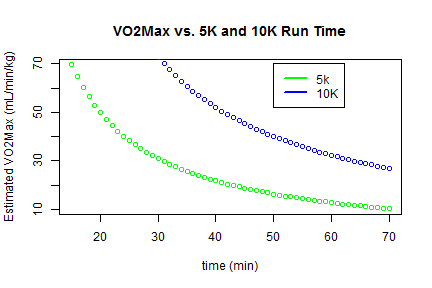

## Race Predictor Summary

- Want to know how fast you will run your next race? 

- The Race Predictor Shiny App lets your predict your race time?

    -- You enter: prior race distance (meters) and Time (min)

    -- You enter: future race distance (meters)

    -- The App estimates VO2Max from the prior race
    
    -- The App predicts your future race time assuming VO2Max constant

---
## VO2Max

- Your race pace is limited by the energy your body can apply to running

- Theoretically, running energy is limited by the maximum volume of oxygen your body can use. This value is called VO2Max and is measures the milliliters of oxygen used in one minute per kilogram of body weight
    
- In practice, VO2Max tells only part of the story, but it still can be used for predictions.  Running efficiency is very important.


 

---
## Key Race Predictor Equations

- Velocity: 

*v = (prior race distance in meters)/(prior race time in seconds)* 

- Ratio of prior effort to the maximum effort: 

*PercentMax = 0.8 + 0.1894393 e^(-0.012778 t) + 0.2989558 e^(-0.1932605 t)*

- Estimate of prior race oxygen uptake (VO2): 

*VO2 = -4.60 + 0.182258 v + 0.000104 v^2*

- Estimate of VO2max:  

*VO2MAX = VO2/PercentMax*

---

## Summary

- V02 Technique can predict your race time
- Race Times are also influenced significantly by other factors
- Thank you for your time

- *Race Predictor Example*


```r
dm <- 5000        #Prior Race distance in meters
nDm <- 10000      #Future Race distance in meters
tm <- 30          #Prior Time in Minutes
nT <- predictTime (dm, nDm, tm)
paste("Predicted 10K Race Time (m):",round(nT,2), "(min)")
```

```
## [1] "Predicted 10K Race Time (m): 62.38 (min)"
```


